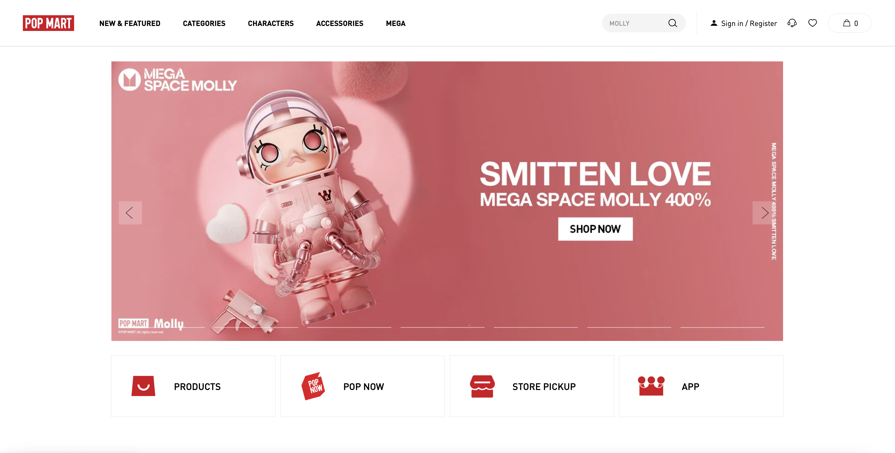
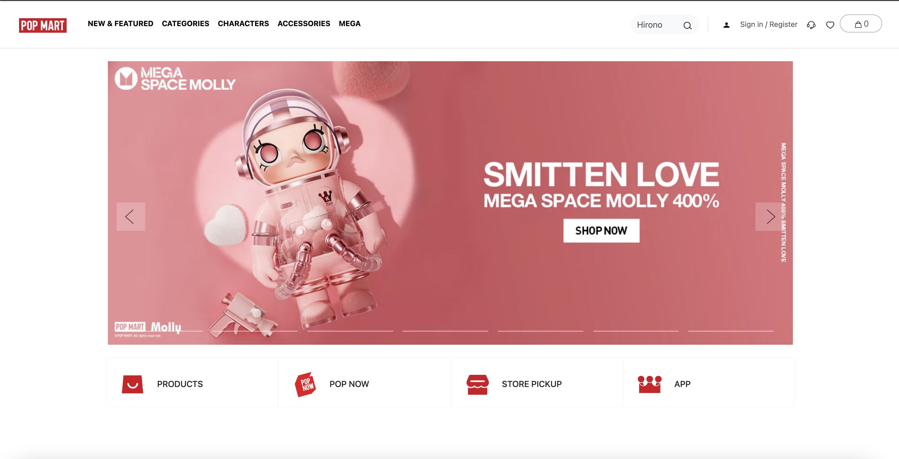

I was excited to learn Bootstrap, the world’s most popular framework for building responsive sites, but I didn’t expect it to be so complicated. Before diving into my experience with Bootstrap, I’d like to briefly introduce the framework.

Bootstrap 5 was developed by Mark Otto and Jacob Thornton at Twitter to create a consistent and efficient approach to interface development. It includes HTML, CSS, and JavaScript files that provide prebuilt components, styles, and interactive elements, allowing developers to build websites quickly and efficiently.

During my first week with Bootstrap, I encountered several challenges, including learning its grid system, forms, and components while working on our WODs (Workouts of the Day) to replicate different websites.

## Week One Analysis

The assignments for this week heavily emphasized avoiding CSS, but so far, CSS has been the only way we've learned to style websites. As I read through the Bootstrap documentation, I realized how limited our creative freedom feels compared to writing raw CSS. With CSS, we can define grids, flexboxes, sizes, and padding exactly as we want. Now, everything we implement relies on predefined classes and an overwhelming number of div elements.

I noticed that most of my div elements had at least two class names, while some had as many as five. Seeing so many classes in a single line of code—just to style my HTML—made my code feel cluttered and confusing. At times, I wasn’t even sure if a class was a custom class I had assigned or a Bootstrap class used for styling.

Although I find Bootstrap frustrating at times, this is only my first week using it. With more practice, I believe I'll get used to the framework and start appreciating the benefits it offers.

## One of my Assignment using Bootstrap 5 

We were tasked with choosing a webpage from the internet to replicate using mostly Bootstrap instead of CSS. I chose to recreate the hero section of the Pop Mart shop. Getting the navigation bar just right took me a while, but I did my best to replicate the page—even though it’s not perfect.

One of the biggest challenges I faced was adjusting the image size for the carousel in the middle. I tried using the w-# class to control the width, but I found that w-75 was too small, while w-80 was slightly too large compared to the original site. Additionally, the four buttons at the bottom don’t look exactly the same—I struggled to add padding to each individual div that I created using Bootstrap.

These limitations were frustrating because all I could think about was how much easier it would have been to style these elements using regular CSS. However, despite these challenges, I’m proud of my work, and it has made me think about how I can improve it after another week of using Bootstrap—while still incorporating a bit of custom CSS where needed.

  
   Original

  
   Replicate

## Benefits  

I know that my experience with Bootstrap so far hasn’t been the best, but I understand why learning this type of framework is beneficial for job opportunities. Compared to raw CSS, Bootstrap has more limitations. For example, buttons in Bootstrap follow a standard look, and if you want a unique design, you’ll need to customize them using CSS.

That being said, most companies rely on fast and consistent design, which is where Bootstrap shines. While I’m still getting used to it, becoming proficient in this framework will help me in the job market. Additionally, Bootstrap is especially useful for collaborating with a team of software engineers. With a standardized design system and consistent code structure, it makes projects easier to understand and maintain.

## Takeaway

Although Bootstrap limits my creative freedom in design, I’ve realized that it also has many advantages, especially when working under tight deadlines while developing a website. Mastering this framework is beneficial for front-end developers, full-stack developers, freelancers, and UI/UX designers.

Since I have an interest in these fields, I’m committed to improving my skills with Bootstrap and making the most of what it has to offer.

*ChatGPT was used to refine the grammar and the clarity of my writing, however, all ideas and contents are entirely my own.*
