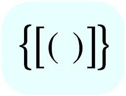

"Will I ever be good enough?” “Can I ever catch up with the smarter people in my class?” Questions like these flow endlessly like a river in my head, for I am not the best designer, nor am I proficient at writing, and I am still very new to coding. Despite my worries and doubts, I am determined to achieve a bachelor's degree in Computer Science. I believe that as long as I keep trying, my hard work will pay off in the end. 

## Journey after my Interface Program 

Transitioning from being a design student to pursuing a degree in Computer Science was a bit absurd, and was never part of my plan. That is, until I had the opportunity to learn some basic HTML, CSS, and Javascript during the final year of my design program. While I had a creative background, I kept having the urge to learn how to bring my design to life. Straight out of high school, I chose to major in a design degree since that was the easiest and most suitable path for me, especially since I didn’t see myself as an exceptional student compared to some of my friends and classmates. 

However, during the final year of my design program, I realized that I enjoy figuring out the technical part of things, which gave me more satisfraction than creating a design. Towards the end of my program, I decided to continue my education and pursue my bachelor degree in Computer Science. It was clear that this path I’m walking into was a challenge I have never face before. Nevertheless, I decided to push my limits and test my abilities, since no one will ever know until they try. 

## The Beginning

I began my journey with courses like ICS 111, an introduction to Java, and math classes such as Calculus, which served as a foundation and pre requisites that I need for future advanced classes. As someone who was never book-smart, I am proud to share that I I passed that class with ease. This experience opened my eyes to different possibilities and it would be impossible to know what I am capable of until you take the first step and test the waters. From that moment on, there was no going back. 

## During 

As a beginner learning coding syntax and its rules, I initially found it manageable and even enjoyable. However, everything changed when more language surfaced, the code becoming more complex, new rules and methods were introduced with multiple ways of implementation. As the challenges grew, I noticed myself behind, and the confidence I gave myself started to fade. Even tiny errors from my code started to consume me. The familiar voices in my head telling me I wasn’t good enough resurfaced once again. 

## Where am I at now?

Here in the present, I have decided that I will not let failure and mistakes define who I am, but instead, I will let them guide me towards my potentials and fuel my willingness to keep going. Software Engineering is a has a lot of concepts that are completely new to me, and right now, I feel like I’m in a “for loop” where its condition of me being scared of falling behind loop endlessly which causing me to get nowhere. Compared to others who can excel with dedicating 10 hours a week outside of school to learn, I may need to speed twice as much time, and I would still question whether I understand as much as they do. However, I know that everything I’ve experienced so far has led me to this moment. While I may never fully shut off the voices in my head that tells me I’m not good enough, I will hold myself accountable to learn from my mistakes and, most importantly, trying my best. 

*ChatGPT was used to refine the grammar and the clarity of my writing, however, all ideas and contents are entirely my own.*
