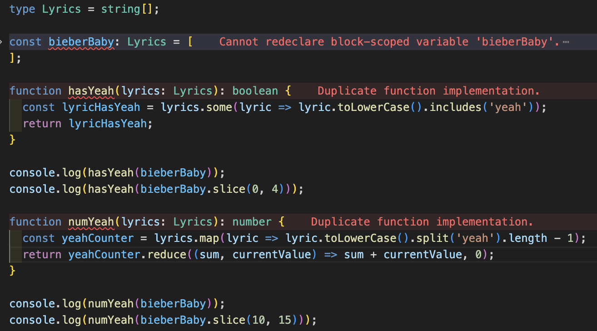

Coding standards are essential guidelines that help ensure consistency and readability in software development. My first exposure to coding standards was through CheckStyle in JGrasp. Initially, I struggled with Checkstyle, finding it difficult to understand the errors and how to fix the format of my code. Over time, I became accustomed to its rules, internalizing practices like proper indentation, spacing, and commenting. These habits made my code cleaner and more understandable, not only for others but for also myself. Now, as I transitioned to using VSCode, I appreciate the discipline Checkstyle instilled in me. Working with ESLint felt similar, and thanks to my experience, I can see how incorporating these tools can ultimately shape me into a better programmer.

## Early stages

During my ICS 111 class, an introductory coding course, we used jGrasp as our IDE to code in Java. As a beginner in programming, I found Checkstyle incredibly frustrating. I remember finishing my code, thrilled that it ran perfectly and was ready to submit, only to hit the Checkstyle button and feel like I was back at square one. Something as small as a missing indentation would trigger an error, and I couldn’t understand why such minor details mattered so much. At the time, I was confused and annoyed, wondering why I needed to care so much about formatting when the code worked just fine.more about it.

## ESLint So Far

My experience with ESLint has been much smoother, thanks to my prior experience with Checkstyle. However, it can still be frustrating at times, especially when it throws errors early in the coding process—like when I’ve just started a file or haven’t yet used a function I created. This initially threw me off guard, as Checkstyle never flagged errors until I explicitly asked it to check my code. Despite these occasional frustrations, I’ve come to appreciate the benefits of ESLint. Its real-time feedback helps catch issues early, ensuring my code adheres to standards from the very beginning, which ultimately leads to cleaner and more maintainable code.

  
   

## Benefits 

There are many benefits to using ESLint, especially in team settings. It helps maintain consistency in code formatting by enforcing rules, making it easier for others to read and understand the code. Although it can be frustrating when it displays errors before you finish coding, this can also be an advantage. If you complete your code without noticing a bug, you may end up spending more time fixing the entire code later. Therefore, there are many benefits to using ESLint, and I use it to better understand Java.

*ChatGPT was used to refine the grammar and the clarity of my writing, however, all ideas and contents are entirely my own.*
