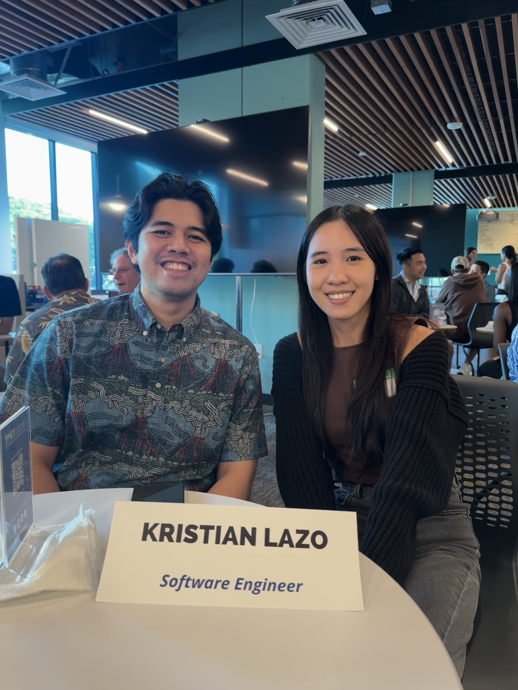

I recently had the opportunity to attend the “Tech Minds Meetup,” an event where students like me could meet and interact with software engineers and company founders from both local and global companies. Events like this are crucial for students because they provide a chance to ask questions, network with professionals, and gain insights that could help with job hunting in the future. Throughout the event, I not only learned what I should focus on to land an internship or job at these companies, but I also discovered how a school project could potentially lead to a job offer even before graduating.

## The Event

During the event, I had the chance to speak with three professionals. Two of them were from VolunteerAlly, a company that specializes in volunteer management software, and both had secured jobs before graduating college—an impressive feat. The third professional I spoke to was a remote software engineering manager at Meta. These conversations taught me how crucial personal projects, technical skills, and even personality are in the hiring process. 

The Meta manager emphasized that personality plays a significant role in hiring decisions because collaboration and teamwork are essential in the workplace. He explained that Meta, being a highly competitive company, looks for candidates with prior experience and a strong portfolio. This made me realize that I need to start building my portfolio with meaningful projects and pursue internships while still in college to stay ahead in the game. Without attending this event, I might not have understood how important these steps are.more about it.

## The One Who Landed His Job in ICS 314

One of the most inspiring stories came from Kristian, one of the professionals from VolunteerAlly. When I asked him how he landed his job before graduating, he shared that it was through his experience in ICS 314, a software engineering class at the University of Hawaii. In this class, students are required to complete a group project at the end of the semester. Kristian’s team developed a project that caught the attention of VolunteerAlly. The company was so impressed with their work that they offered Kristian and his teammates positions upon graduation. This revelation surprised me because it showed that school projects aren’t just mundane assignments—they can be opportunities to showcase creativity, technical skills, and problem-solving abilities. If done well, these projects can even lead to job offers.

  
   

## Takeaway From This Event 

This was my second time attending the Tech Minds Meetup, and I had an incredibly rewarding experience, as always. I believe more students should consider attending events like this because they offer more than just a chance to ask questions. They provide valuable information, networking opportunities, and inspiration to push yourself further. Before this event, I never thought it was possible to land a job while still in college. Now, I’m motivated to work harder on my projects, incorporate UI/UX design to make them stand out, and take every opportunity to network with professionals. In such a competitive field, putting yourself out there and making connections is essential to standing out.

*ChatGPT was used to refine the grammar and the clarity of my writing, however, all ideas and contents are entirely my own.*
