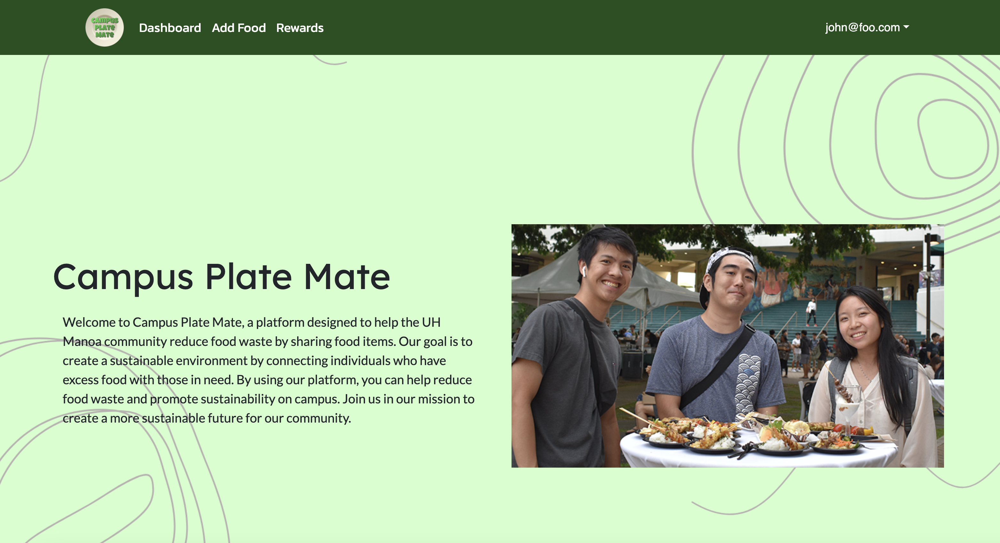

   

## Overview
_Campus Plate Mate_ is a web application designed to reduce food waste within our college campus community. Built using Next.js, the platform allows users to post available food items or claim food shared by others through a simple and intuitive dashboard. By connecting students with excess food to those in need, the app promotes sustainability, resource sharing, and community support on campus.

## My Contributions
I acted as the deployment and database lead, ensuring our application was correctly set up on Vercel and integrated with Supabase for secure and scalable data management. I also collaborated with the team to ensure a smooth development-to-production pipeline.

Coding:
- I handled the full deployment of the app using Vercel, including managing environment variables and resolving production issues. 
- I styled the landing page, contributing to the visual layout design.
- I helped design and build the profile page, including the functionality to display user-specific posts dynamically.

## What I learned
Within this project, I learned how to use Bootstrap for styling and responsive design, and how to deploy a web application using _Vercel_. I also gained experience working with _Supabase_ to store and manage backend data securely. Through building with the _Next_.js framework, I developed a better understanding of modern full-stack development. Additionally, I learned how to use _GitHub Projects_ and Issues to track our progress, manage tasks, and collaborate effectively with my team.

[View Website](https://plate-mate-bice.vercel.app/).
[View Github](https://github.com/campusplatemate/application).
